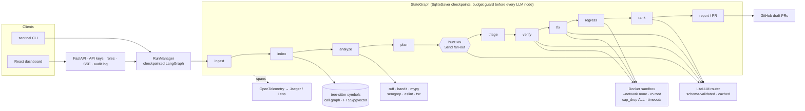

# Sentinel — Autonomous Codebase Auditor

[](https://github.com/AmatyaJoshi/SENTINEL-Autonomous-Codebase-Auditor/actions/workflows/ci.yml)
 

Sentinel is a LangGraph multi-agent system that clones a repository, builds a semantic + structural
index, hunts for bugs with static analyzers and LLM agents, **proves each bug by writing a failing
test that runs in a network-isolated Docker sandbox**, generates a minimal fix, verifies the fix
against the repository's own test suite, and opens a reviewable draft pull request with a full audit
trail. Every step is traced with OpenTelemetry, exposed through a role-based REST/SSE API, and
visualised in a live dashboard. Detection quality is measured on a reproducible bug-injection
benchmark against three comparison arms, including the "single-shot LLM review" everyone else ships.

**Why this is not a toy:** a finding only counts if an executable test reproduces it. Suspicions that
fail verification are still reported, but under "unverified", never as bugs.

---

## Architecture



| Node | What it does |
|---|---|
| ingest | clone at pinned SHA; detect language, package manager, test framework; build the per-repo sandbox image (the only step with network) |
| index | tree-sitter symbols → function-level chunks → embeddings → hybrid BM25+vector store; networkx call graph |
| analyze | ruff, bandit, mypy, semgrep, eslint, tsc in parallel → SARIF-normalised seeds |
| plan | churn × complexity × analyzer hits × missing tests × blast radius → LLM ranks ≤ N targets (heuristic fallback) |
| hunt | one ReAct sub-agent per target with read-only tools, 12-call cap, prompt-injection-hardened |
| triage | dedupe; blend hunter confidence with the triage classifier; drop below threshold (kept as "refuted", never hidden) |
| verify | LLM writes a test that must **fail for the hypothesised reason**; up to 3 attempts in the sandbox |
| fix | minimal unified diff (≤ 60 lines) validated with `git apply --check`; the new test must pass |
| regress | full existing suite on each patch in isolation; flaky guard; regressions discard the patch |
| rank | severity × confidence × blast radius; one-paragraph explanation per verified bug |
| report | report.md / json / html; draft PR per bug (or grouped); humans merge |

## Quickstart

```bash
uv sync --all-groups
cp .env.example .env               # add an LLM key to enable hunt/verify/fix
uv run sentinel --help

uv run sentinel index  https://github.com/pallets/click      # symbols, chunks, embeddings, call graph
uv run sentinel search "how are command options parsed"
uv run sentinel analyze ./repo --sarif out.sarif             # analyzers only, SARIF 2.1.0
uv run sentinel audit  https://github.com/you/repo --max-usd 3   # full graph → .sentinel/runs/<id>/report.html
uv run sentinel audit  ./repo --review                       # pause before PR for human approval
uv run sentinel replay <run_id> --from verify                # resume from a checkpoint
uv run sentinel serve                                        # API + dashboard on http://127.0.0.1:8000
```

Docker is required for verification. Without it the audit still runs and the report is explicit that
findings are **unverified candidates**. Build the sandbox base images once:

```bash
docker build -f sentinel/sandbox/images/Dockerfile.python -t sentinel-base-python:3.12 sentinel/sandbox/images
docker build -f sentinel/sandbox/images/Dockerfile.node   -t sentinel-base-node:20     sentinel/sandbox/images
```

### Full stack

```bash
docker compose up -d        # API+dashboard :8000, Postgres+pgvector :5432, Jaeger UI :16686
```

### Dashboard

`dashboard/` is a Vite + React + TypeScript app (Tailwind, framer-motion, recharts) served by the API
from `dashboard/dist`. Live pipeline graph, SSE activity feed, findings drawer with test/patch/logs,
review approve/reject, benchmark charts, API-key settings, dark/light theme, demo mode without a
backend.

```bash
cd dashboard && npm ci && npm run dev      # http://localhost:5173 (proxies /api to :8000)
npm run build                              # → dashboard/dist, picked up by `sentinel serve`
```

## API

Documented in [docs/API.md](docs/API.md); interactive docs at `/api/docs`. Authentication is by
`X-API-Key` with roles `viewer` / `operator` / `admin`. Run events stream over SSE with
`Last-Event-ID` replay. Every mutating call is written to the audit log.

## Benchmark

```bash
uv run python bench/run_bench.py --suite small          # 5 repos × 6 mutations, 4 arms
uv run python bench/run_bench.py --suite small --arms analyzers,single_shot --inject-only
```

Mutation operators (`bench/inject/operators.py`): OffByOne, NullCheckRemoval, ExceptionSwallow,
ResourceLeak, WrongOperator, TypeConfusion, AsyncMisuse, ReturnMutation, SecuritySmell. A mutant is
kept only if at least one existing test fails on it; that test is then skipped in the copy Sentinel
audits, so Sentinel must rediscover the bug. Scoring is lenient (file + ±5 lines) and strict (+
category), per arm: analyzers only, single-shot LLM review, Sentinel without triage, Sentinel.
Results are appended to [bench/RESULTS.md](bench/RESULTS.md) with date and commit.

**Numbers reported here are measured, never estimated.** No benchmark has been run yet with a live
LLM; the table is empty until the nightly job runs with `BENCH_ENABLED=true` and an API key.

## Triage classifier

`training/` builds a repo-split dataset from the findings table (label = survived verification),
trains a dependency-free logistic-regression baseline and a Qwen2.5-Coder LoRA classifier, evaluates
AUROC / F1 / Brier / calibration against hunter-confidence-only, heuristic priors, and an LLM judge,
and reports sandbox runs avoided. Until a model is trained, `sentinel.triage.model.HeuristicTriage`
supplies calibrated per-category priors.

## Enterprise operation

- **Isolation:** Docker-only sandbox, `--network none`, read-only root FS, all capabilities dropped,
  unprivileged UID, memory/CPU/pid limits, hard timeouts. No host execution path exists. See
  [SECURITY.md](SECURITY.md).
- **Governance:** draft PRs only, human review gate (`--review`), audit log, budget caps per run,
  RBAC on the API, redacted settings endpoint.
- **Operations:** structured JSON logs (`SENTINEL_LOG_JSON=1`), `/health` and `/ready`, OpenTelemetry
  spans for every node, LLM call and sandbox execution, Postgres for multi-user deployments,
  multi-stage Docker image with health check, Dependabot, CI on every PR.
- **Reproducibility:** temperature 0, pinned models, LLM responses cached by content hash, pinned
  repo SHAs recorded in benchmark manifests, prompts versioned by content hash on every span.

## Deviations from SPEC.md §2.2

- Official per-language tree-sitter packages replace the unmaintained `tree-sitter-languages`;
  `tree-sitter` is pinned `<0.26` (0.26.0 access-violates on Windows).
- SQLite is a first-class dev backend (FTS5 + cosine, SqliteSaver) next to Postgres + pgvector.
- The dashboard is Vite + React rather than Next.js: it is served as static files by FastAPI, which
  keeps the deployment a single container.
- Semgrep has no Windows build; it runs from a local binary or the official Docker image.

## Risks & mitigations

| Risk | Mitigation |
|---|---|
| Hunter hallucinates bugs | executable verification gate; triage classifier; false positives penalised in the benchmark |
| Cost blow-up on large repos | budget guard node, plan caps targets, content-hash LLM cache, cheap model for hunt / strong for verify+fix |
| Flaky tests corrupt regression signal | failing tests re-run before counting; baseline failures recorded per run |
| Repo tests need network/services | detected by the baseline run; report marks regression as partial |
| Benchmark leakage | injected-bug track is primary; real-issue track uses post-cutoff commits; disclosed in RESULTS.md |
| Prompt injection via repo content | tool output wrapped in `<sentinel-data>` blocks; system prompt forbids following it; hunter has no write tools |

## Status

| Phase | Scope | Status |
|---|---|---|
| 0 | skeleton, CLI, config, DB, CI, compose | done |
| 1 | ingest, tree-sitter index, hybrid search, call graph, analyzers | done |
| 2 | Docker sandbox, image cache, test runners, JUnit | done (unit-tested with mocked Docker; live run pending a Docker host) |
| 3 | graph plan → hunt → verify, tools, prompts, checkpointer, budget guard, replay | done (end-to-end with scripted LLM) |
| 4 | fix → regress → rank → report → PR | done (PR path needs a GitHub token) |
| 5 | benchmark harness, 4 arms, nightly small suite | done (harness tested end-to-end on the fixture; real numbers pending) |
| 6 | telemetry spans, API, dashboard | done |
| 7 | triage dataset, LoRA + baseline training, eval, router integration | scripts done; model not yet trained (needs ≥ 3k labelled candidates) |
| 8 | polish, GIF demo, real PR screenshots | pending |

## License

MIT.
